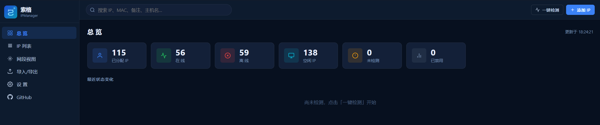
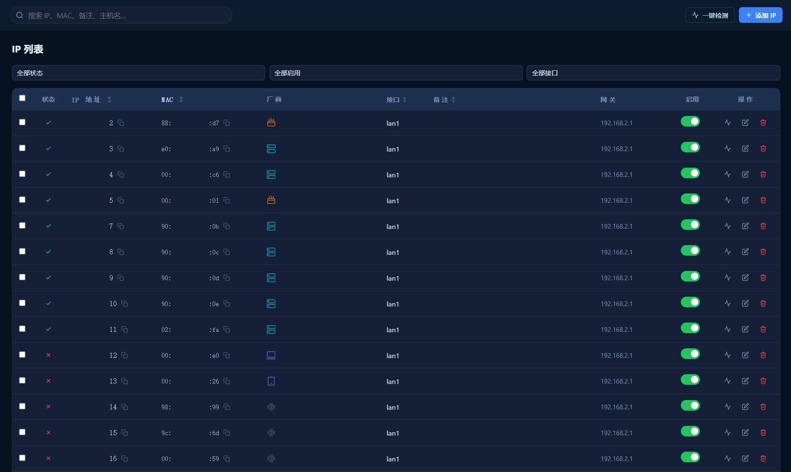
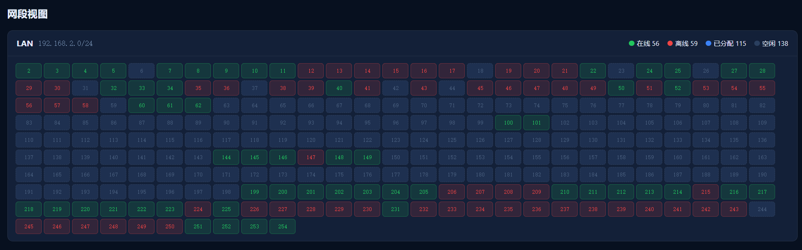
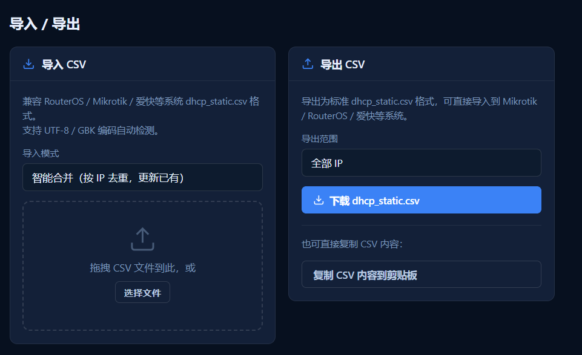

# 索格 IPManager

轻量级 PHP 网络管理工具，专为家庭和小型办公网络的 **DHCP 静态 IP 地址管理** 设计。无需数据库，所有数据以 JSON 文件本地存储。

---

## 主要功能

- **IP 地址管理** — 完整的增删改查，支持启用/禁用切换和批量删除
- **端口映射管理** — NAT 端口映射管理，兼容爱快 iKuai 的 `dst_nat.csv` 格式导入导出
- **CSV 导入/导出** — 兼容 RouterOS、MikroTik、爱快、OpenWrt 的 `dhcp_static.csv` 格式，自动识别 UTF-8 / GBK 编码
- **多方式设备检测** — 级联探测：ARP → ICMP Ping → TCP 端口扫描（15 个常见端口）→ HTTP 请求
- **并发批量检测** — 用户可配置并发数（1–20），默认 5 并发，一键检测全量 IP
- **MAC 厂商识别** — 自动查询 macvendors.com 并本地缓存（缓存有效期可配）
- **设备类型自动识别** — 根据 MAC 厂商和备注自动识别手机、电脑、服务器、路由器、摄像头、打印机、IoT 等设备类型
- **可视化网段视图** — 网格布局展示网段内已分配 IP（含在线/离线状态）和空闲 IP
- **总览仪表盘** — 统计卡片、设备类型分布、网段概览、最近状态变化
- **端口映射概览** — 仪表盘直接查看最近的端口映射
- **会话安全** — bcrypt 密码哈希、CSRF 防护、登录后 session 重新生成、支持修改用户名
- **深色主题 UI** — 全深色主题响应式界面
- **Docker 支持** — 提供 Dockerfile 和 docker-compose，GitHub Actions 自动构建多平台镜像

## 界面截图

### 总览面板



统计卡片、设备类别分布、网段概览、最近状态变化、端口映射快捷预览。

### IP 列表



搜索、筛选（状态/启用/接口）、排序、行内切换启用、MAC 厂商与设备图标显示、一键复制。

### 网段视图



每个网段的可视化网格：已分配地址按状态着色，空闲地址清晰可辨，点击可分配或查看详情。

### 导入导出



拖拽 CSV 预览、三种导入模式、一键导出 DHCP 和端口映射数据。

## 文件结构

```
├── index.php          登录页面
├── app.php            主界面 SPA 入口
├── api.php            JSON API 接口
├── logout.php         退出登录
├── includes/
│   ├── config.php     应用常量与数据目录初始化
│   ├── auth.php       用户认证、bcrypt、CSRF
│   ├── data.php       CRUD、CSV 解析、缓存、设置
│   └── ping.php       多方式在线检测
├── assets/
│   ├── app.js         单页应用前端逻辑
│   └── style.css      深色主题样式
├── data/              数据存储目录（受保护）
└── docker/            Docker 部署相关文件
```

## CSV 兼容性

导入/导出的 CSV 格式兼容以下系统：

- RouterOS / MikroTik `dhcp_static.csv`
- 爱快 iKuai `dhcp_static.csv` 及 `dst_nat.csv`（端口映射）
- OpenWrt / LEDE 等兼容系统

### 导入说明

- 支持拖拽或选择文件
- 自动识别 UTF-8 / GBK 编码
- 三种导入模式：**智能合并**（按 IP 去重）、**追加**、**替换**

### 导出说明

- 生成标准 `dhcp_static.csv` 或 `dst_nat.csv`
- 可选仅导出已启用的记录

## 快速开始

### 传统部署（Apache / Nginx）

1. 部署到 PHP 8.0+ 服务器
2. 浏览器访问 `index.php`
3. 登录账户：`admin`，密码：`admin`
4. 进入设置页修改密码并配置网段

### Docker 部署

```bash
cd docker
cp .env.sample .env
docker compose up -d
```

访问：`http://localhost:8080`

> 数据持久化在宿主机 `./data` 目录。如需修改端口，编辑 `.env` 中的 `HTTP_PORT`。

## 设置项说明

| 设置项 | 说明 | 默认值 |
|--------|------|--------|
| 默认网关 | 新增 IP 时的默认网关 | `192.168.2.1` |
| 默认接口 | 新增 IP 时的默认接口 | `lan1` |
| Ping 超时 | 每个 IP 的超时时间（毫秒） | `1000` |
| Ping 并发数 | 同时检测的 IP 数量（1–20） | `5` |
| MAC 厂商缓存有效期 | 厂商结果缓存（月） | `6` |
| Docker 宿主 IP 范围 | 配置后始终标记为在线 | — |
| 启用 ARP 检测 | 优先使用 ARP 探测 | 关闭 |

### ARP 检测说明

- **host 网络模式**：可以开启 ARP（推荐，可提升速度）
- **bridge 网络模式**：不要开启 ARP（容器 ARP 可见性受限，可能拖慢整体检测）

## 设备检测流程

按以下顺序级联探测，一旦成功立即返回：

1. **Docker 宿主** — 配置范围内的 IP 直接标记为在线
2. **ARP** — 局域网设备快速探测（需开启）
3. **ICMP Ping** — 标准 ping 命令
4. **TCP 端口扫描** — 15 个常见端口（80, 443, 22, 8080, 53, 23, 21, 3389, 445, 554, 1883, 8443, 5001, 9090, 8888）
5. **HTTP 探测** — 向 80/8080/8888/8008 端口发送 HEAD 请求

> 若服务器禁用了 `exec()`，ICMP 和 ARP 将自动跳过，回退到 TCP/HTTP 方式。

## 注意事项

- 确保 `data/` 目录对 Web 服务器可写
- 不依赖数据库，纯文件存储
- 单用户认证模型
- 所有写操作均受 CSRF 防护
- 登录后 session 自动重新生成，防止会话固定攻击

## 许可

MIT License
